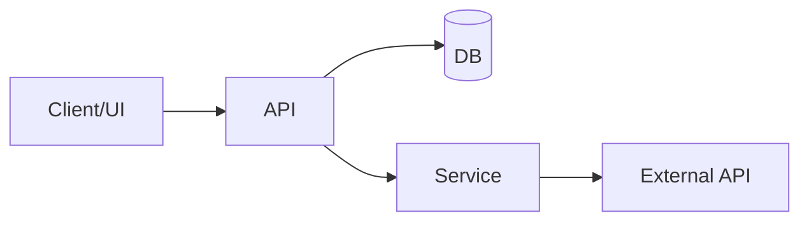
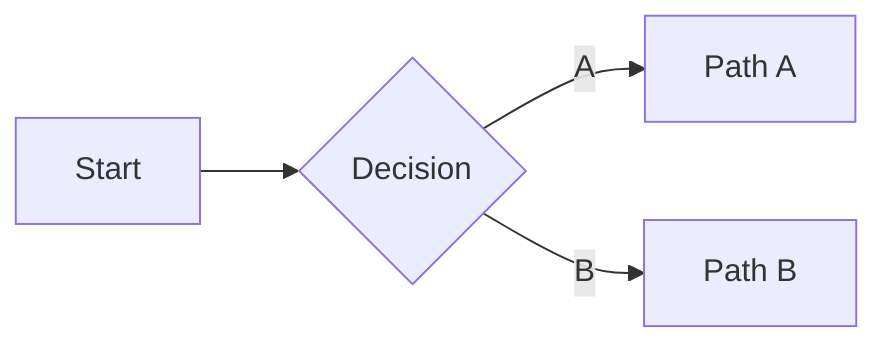

# VSCodeDesignLab — Project Memory

## User Info

Keep contact and preference details to speed up collaboration.

### Contacts
- Owner: <name/handle/email>
- Maintainers: <list>
- Stakeholders: <list>

### GitHub
- Username: <github-username>
- Organization(s): <orgs>
- Primary repo(s): <owner/repo>
- Default branch: <main|master>
- PR style: <small/atomic/labels>
- Issue tracker: <url>

### Working Norms
- Timezone/Hours: <e.g., UTC-5, 9–5>
- Cadence: <standup/weekly review>
- Preferred comms: <Slack/Email/Issues>

### Preferences
- Code style: <notes>
- PRs: <size/review expectations>
- Documentation: <level of detail>

### Access
- Secrets/Keys: <where/how managed>
- Permissions: <who can deploy/merge>

---

## Table of Contents
- [User Info](#user-info)
- [Project Brief](#project-brief)
- [Project Context](#project-context)
- [Repository Visual](#repository-visual)
- [Active Context](#active-context)
- [Decision Log](#decision-log)
- [Progress](#progress)
- [System Patterns](#system-patterns)
- [Architect Notes](#architect-notes)

---

## Project Brief

- Project: VSCodeDesignLab
- Date: 2025-08-16
- Version: 1.2.0

### Goal
Ship a production-ready VS Code theme editor (like themes.vscode.one) with two-panel UI, live preview, import/export, navigation, and template-backed descriptions.

### Scope
- In:
  - Colors (categorized), Tokens, Semantic editing
  - Live preview (workspace/user scope)
  - Import JSON/JSONC/VSIX, Use Current, Start Blank
  - Export JSON, CSS variables, VSIX
- Out:
  - Online gallery hosting; multi-theme management

### Risks & Assumptions
- Risks: Webview performance with large categories; user confusion with fontStyle combinations; VSIX packaging edge cases
- Assumptions: Template is authoritative for color keys and descriptions
- Mitigations: Virtualize color list if needed; validate inputs; minimal VSIX scaffold

### Links
- Repo: local workspace

---

## Project Context

Use this section to capture the practical setup and constraints for the project.

### Repository & Workspace
- Monorepo/Repo: <org/repo or path>
- Workspace root: <relative path>
- Packages/Apps: <list>

### Environments
- Dev: <url/notes>
- Stage: <url/notes>
- Prod: <url/notes>

### Tech Stack
- Extension: VS Code API, TypeScript
- Webview: TypeScript, DOM, CSS
- Build: Webpack + ts-loader + copy-webpack-plugin

### Tooling & Scripts
- Package manager: npm
- Scripts: build, watch, dev, package

### Conventions
- Versioning: SemVer
- Commits: Conventional Commits (suggested)

### Constraints & Compliance
- Constraints: <performance/security/legal>
- Compliance: <licenses/PII/GDPR/etc>

---

## Repository Visual

High-level view of the repo to speed up onboarding and navigation.

### Directory Tree (paste or generate)
```
<project-root>/
  README.md
  package.json
  src/
    index.ts
    ...
  tests/
    ...
```

### Module/Flow Diagram (optional)


---

## Active Context

- Today: <YYYY-MM-DD>
- Workspace: <path/name>

### Now
- [x] Scaffold UI and messaging
- [x] Import/export wiring
- [x] Live preview writing
- [ ] Colors alpha slider and enhanced search

### Recent
- Added toolbar (Use Current, Blank, Import, Export) and Start Blank command.

### Next
- [ ] Task 3
- [ ] Task 4

### Blockers
- …

### Quick Links
- Issue/PR board: <url>
- Docs/Spec: <url>

### Notes
- Decisions go to Decision Log
- Update Progress weekly

---

## Decision Log

### 2025-08-16 — Asset loading + build
- Context: TS complained about importing JSON and ensuring availability at runtime
- Decision: Use `require()` in extension code; copy asset via `copy-webpack-plugin`
- Consequences: Simple and robust; no ESM complications

### 2025-08-16 — Live preview scope
- Context: Users may want workspace vs user settings
- Decision: Add `designLab.preview.applyToWorkspace` (default true)

---

## Progress

### Weekly Summary
- Week of <YYYY-MM-DD>
  - Done: …
  - Next: …
  - Risks: …

### Metrics (optional)
- Build status: <badge/link>
- Test coverage: <%/link>
- Performance: <TTI/CLS/etc>

---

## System Patterns

### Architecture
- Overview: <diagram/description>
- Key components: <list>

### Data Contracts
- Schema: <links/files>
- APIs: <endpoints/methods>

### Standards & Conventions
- Code style: <linters/formatters>
- Error handling: <policy>
- Logging: <levels/structure>

### Testing Strategy
- Unit: <framework>
- Integration: <scope>
- E2E: <tool>

### Operations
- Environments: <dev/stage/prod>
- Deploy: <process>
- Monitoring: <dashboards/alerts>

---

## Architect Notes

Use this for deeper technical thinking, ADRs, and diagrams.

### Context
- Problem: …
- Constraints: …

### Options
- Option A — <name>
  - Pros: …
  - Cons: …
- Option B — <name>
  - Pros: …
  - Cons: …

### Decision
- Selected: <option>
- Why: …
- Impact: …

### Diagram


### Follow-ups
- [ ] Task 1
- [ ] Task 2
